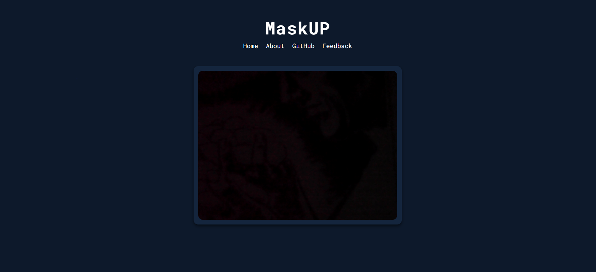
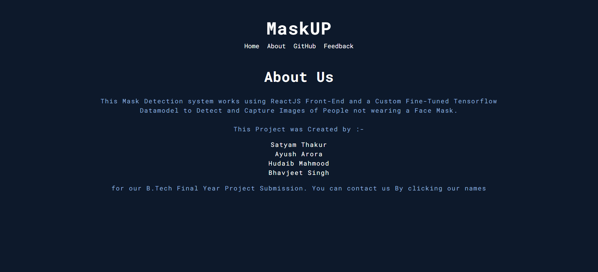

# B.Tech Final Year ( Major ) Project - MaskUP

This Mask Detection cum Verification system works using a Custom Fine-Tuned Tensorflow Datamodel that detects objects in real time and uses Deep Learning models to classify between given data sets. This implementation detects if the person is wearing a Face Mask or not and Captures Images of People not wearing a Face Mask.

### Members :-

- Satyam Thakur
- Ayush Arora
- Hudaib Mahmood
- Bhavjeet Singh

### Screenshots :-

- Homepage with the Camera Component
  

- About us
  

- Feedback Page
  

### Links

- Live Site URL: [Github Pages](https://xiibrightside.github.io/MaskUP/)

### Built with

- ReactJS
- Python
- Keras
- Tensorflow
- Tailwind-CSS
